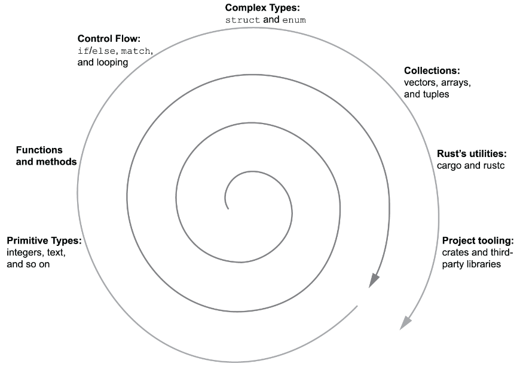

# Rust in Action - Language foundations

#### Chapter 02

This chapter covers

- Coming to grips with the Rust syntax
- Learning fundamental types and data structures
- Building command-line utilities
- Compiling programs

-----------------------------

The chapter takes a spiral approach to learning. A few concepts will be discussed multiple times.

- Primitives Types:
    - integers, text and so on

- Functions and Methods

- Control Flow:
    - if/else, match and looping

- Complex Types:
    - struct and enum

- Collections:
    - vectors, arrays and tuples

- Rust's utilities:
    - cargo and rustc

- Project tooling
    - crates and third-party libraries

